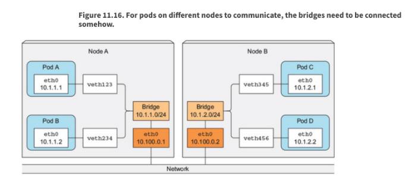
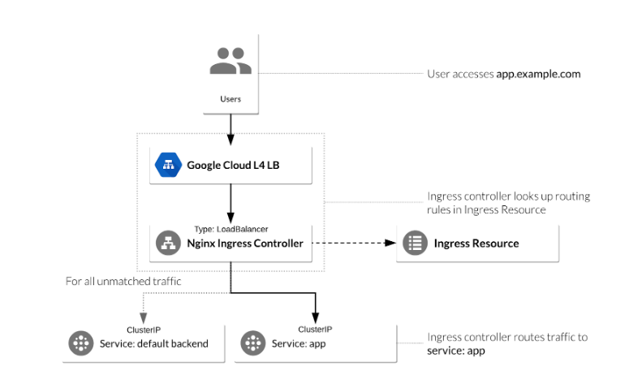

# 服务和网络

## 理解集群节点上的主机网络配置



在主机级别，我们有一个接口（通常是 `eth0` 或 `ens192` 等）作为主要网络适配器。  

每个主机负责 CNI 范围的一个子网。在这个例子中， 左侧主机负责 10.1.1.0/24，右侧主机负责 10.1.2.0/24。整体 Pod CIDR 块可能类似于 10.1.0.0/16。

虚拟以太网适配器与相应的 Pod 网络适配器配对。内核路由用于使 Pods 能够与其所在主机之外的其他主机通信。

## 理解 Pods 之间的连接

每个 Pod 都有自己的 IP 地址。这意味着你无需显式地为 Pod 之间创建连接，也几乎不需要处理容器端口到主机端口的映射。这种方式创建了一个简洁且向后兼容的模型，从端口分配、命名、服务发现、负载均衡、应用配置和迁移等角度来看，Pod 可以像虚拟机或物理主机一样对待。

Kubernetes 对任何网络实现都提出了以下基本要求（不包括有意的网络分段策略）：

* 一个节点上的 Pod 可以与所有节点上的所有 Pod 通信，无需 NAT
* 一个节点上的代理（如系统守护进程、Kubelet）可以与该节点上的所有 Pod 通信

注意：当运行使用 `hostNetwork` 的工作负载时：

处于主机网络的 Pod 可以与所有节点上的所有 Pod 通信，无需 NAT

## 理解 ClusterIP（集群IP）、NodePort（节点端口）、LoadBalancer（负载均衡器）服务类型和端点

Pod 是临时性的。因此，将它们置于提供稳定、静态入口的 Service 后面，是 Kubernetes Service 对象的基本用途。重申一下，Service 主要有以下几种形式：

* ClusterIP（集群IP）- 仅供内部访问
* LoadBalancer（负载均衡器）- 外部访问，需要云服务商或软件实现来提供
* NodePort（节点端口）- 外部访问，需要直接访问节点
* Ingress 资源 - 七层（L7），Ingress 可配置为为服务提供外部可访问的 URL、负载均衡流量、终止 SSL，并支持基于名称的虚拟主机。Ingress 控制器负责实现 Ingress，通常通过负载均衡器，也可以配置边缘路由器或额外前端来帮助处理流量。

## 知道如何使用 Ingress 控制器和 Ingress 资源

Ingress 将来自集群外部的 HTTP 和 HTTPS 路由暴露给集群内的服务。Ingress 由两个组件组成。Ingress 资源是一组用于将入站流量引导到服务的规则。这些是第七层（L7）规则，允许将主机名（以及可选的路径）定向到 Kubernetes 中的特定服务。第二个组件是 Ingress 控制器，它根据 Ingress 资源设置的规则进行操作，通常通过 HTTP 或 L7 负载均衡器实现。要将外部客户端的流量路由到 Kubernetes 服务，必须正确配置这两个部分。



下面的 yaml 创建了两个 Ingress 规则，用于网站 foo.bar.com

默认路径将流量引导到监听端口 80 的服务 “default-service”

以 /foo 结尾的路径将流量引导到监听端口 4200 的服务 “service1”

以 /bar 结尾的路径将流量引导到监听端口 8080 的服务 “service2”

```yaml
apiVersion: networking.k8s.io/v1
kind: Ingress
metadata:
  name: simple-fanout-example
spec:
  rules:
    - host: foo.bar.com
      http:
        paths:
          - path: /
            pathType: Prefix
            backend:
              service:
                name: default-service
                port:
                  number: 80
          - path: /foo
            pathType: Prefix
            backend:
              service:
                name: service1
                port:
                  number: 4200
          - path: /bar
            pathType: Prefix
            backend:
              service:
                name: service2
                port:
                  number: 8080
```

为了让 Ingress 资源生效，集群中必须运行一个 Ingress 控制器。Ingress 控制器作为工作负载部署到 Kubernetes 集群中：

```shell
> kubectl get po -A | grep nginx-ingress
ingress-nginx              nginx-ingress-controller-2gxtd                            1/1     Running     0          14d
ingress-nginx              nginx-ingress-controller-9lrzh                            1/1     Running     0          14d
ingress-nginx              nginx-ingress-controller-r2ksq                            1/1     Running     0          14d
```

## 知道如何配置和使用 CoreDNS

从 1.13 版本开始，CoreDNS 已取代 kube-dns 成为集群 DNS 的提供者，并以 Pod 形式运行。

```shell
kubectl get pods -n kube-system
NAME                                    READY   STATUS    RESTARTS   AGE
coredns-fb8b8dccf-hxbhn                 1/1     Running   9          10d
coredns-fb8b8dccf-jks6g                 1/1     Running   4          8d
```

要查看 Pod 的 DNS 配置，可以启动一个 Pod 并检查 `/etc/resolv.conf`:

```shell
kubectl run busybox --image=busybox -- sleep 9000
kubectl exec -it busybox sh
/ # cat /etc/resolv.conf  
nameserver 10.96.0.10
search default.svc.cluster.local svc.cluster.local cluster.local virtualthoughts.co.uk
options ndots:5
```

`10.96.0.10` 指向 `Kube-DNS` 服务

`Default.svc.cluster.local` 指向带有 `svc.cluster.local` 后缀的命名空间。

所有 Pod 都会被分配一个 DNS 记录，格式如下：

**[用短横线分隔的 Pod IP ].[命名空间].[类型].[基础域名]**

在本例中，`[类型]` 是 `pod`，但服务也可以用相同的方式解析。

例如:

```shell
/ # nslookup 10-42-2-68.default.pod.cluster.local
Server: 10.43.0.10
Address: 10.43.0.10:53

Name: 10-42-2-68.default.pod.cluster.local
Address: 10.42.2.68

```

服务遵循类似的命名规则

**[服务名称].[命名空间].[类型].[基础域名]**

例如:

```shell
my-svc.my-namespace.svc.cluster-domain.example
```

无头服务是没有集群 IP 的服务，但会返回当前时刻可用的 Pod 的 IP 列表。

```yaml
apiVersion: v1
kind: Service
metadata:
  name: test-headless
spec:
  clusterIP: None
  ports:
  - port: 80
    targetPort: 80
  selector:
    app: web-headless
```

我们可以在 YAML 文件中修改 Pod DNS 配置的默认行为：

```yaml
apiVersion: v1
kind: Pod
metadata:
  namespace: default
  name: dns-example
spec:
  containers:
    - name: test
      image: nginx
  dnsPolicy: "None"
  dnsConfig:
    nameservers:
      - 8.8.8.8
    searches:
      - ns1.svc.cluster.local
      - my.dns.search.suffix
    options:
      - name: ndots
        value: "2"
      - name: edns0
```

CoreDNS 还有一个可以修改的 ConfigMap：

```shell
kubectl get cm coredns -n kube-system -o yaml                                                            
apiVersion: v1
data:
  Corefile: |
    .:53 {
        errors
        health
        ready
        kubernetes cluster.local in-addr.arpa ip6.arpa {
          pods insecure
          upstream
          fallthrough in-addr.arpa ip6.arpa
        }
        hosts /etc/coredns/NodeHosts {
          reload 1s
          fallthrough
        }
        prometheus :9153
        forward . /etc/resolv.conf
        cache 30
        loop
        reload
        loadbalance
    }
  NodeHosts: |
    172.16.10.100 k3s-ranch-node-1
    172.16.10.101 k3s-ranch-node-2
    172.16.10.102 k3s-ranch-node-3

```

Corefile 配置包含以下 CoreDNS 插件：

* `errors`: 错误会被记录到标准输出（stdout）。
* `health`: CoreDNS 的健康状况会报告到 `http://localhost:8080/health`. 在这种扩展语法下，lameduck 会让进程变为不健康状态，然后在进程关闭前等待 5 秒。
* `ready`: 当所有能够发出就绪信号的插件都已就绪时，端口 8181 上的 HTTP 端点会返回 200 OK。
* `kubernetes`: CoreDNS 会根据 Kubernetes 服务和 Pod 的 IP 响应 DNS 查询。你可以在 CoreDNS 官网找到该插件的更多细节。ttl 允许你为响应设置自定义的 TTL，默认值为 5 秒。允许的最小 TTL 是 0 秒，最大为 3600 秒。将 TTL 设置为 0 可以防止记录被缓存。pods insecure 选项是为与 kube-dns 的兼容性而提供的。你可以使用 pods verified 选项，只有当同一命名空间中存在匹配 IP 的 Pod 时才返回 A 记录。如果你不使用 Pod 记录，可以使用 pods disabled 选项。
* `prometheus`: CoreDNS 的指标以 Prometheus 格式（也称为 OpenMetrics）在 `http://localhost:9153/metrics` 提供。
* `forward`: 所有不属于 Kubernetes 集群域的查询都会被转发到预定义的解析器（/etc/resolv.conf）。
* `cache`：启用前端缓存。
* `loop`: 检测简单的转发循环，如果发现循环会停止 CoreDNS 进程。
* `reload`: 允许自动重新加载已更改的 Corefile。在你编辑 ConfigMap 配置后，需等待两分钟更改才会生效。

你可以通过修改 ConfigMap 来更改 CoreDNS 的默认行为。

## 选择合适的容器网络接口插件

你必须部署基于 CNI（容器网络接口）的 Pod 网络插件，这样 Pod 之间才能相互通信。在网络安装之前，集群 DNS（CoreDNS）不会启动。

[https://kubernetes.io/docs/concepts/cluster-administration/addons/#networking-and-network-policy](https://kubernetes.io/docs/concepts/cluster-administration/addons/#networking-and-network-policy)

一般来说，CNI 提供某种网络覆盖层。但每种 CNI 都有其自身的特性、限制和注意事项。

CNI 的清单和你集群中的 Kubernetes Pod。典型的工作流程是先搭建好 k8s 集群，然后通过以下方式应用网络 CNI：

```shell
kubectl apply -f <add-on.yaml>
```
