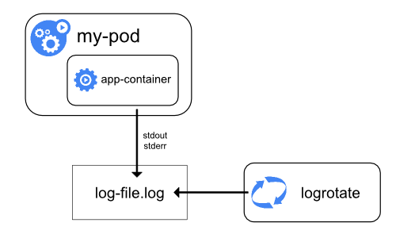

# 故障排查

## 评估集群和节点日志

### 主节点

#### ETCD

通常，大多数 etcd 实现也包含 etcdctl，它可以帮助监控集群状态。如果你不确定在哪里可以找到它，可以执行以下命令：

`find / -name etcdctl`

利用该工具检查集群状态：

```bash
etcdctl --write-out=table --endpoints=$ENDPOINTS endpoint status


+------------------------+------------------+---------+---------+-----------+------------+-----------+------------+--------------------+--------+
|        ENDPOINT        |        ID        | VERSION | DB SIZE | IS LEADER | IS LEARNER | RAFT TERM | RAFT INDEX | RAFT APPLIED INDEX | ERRORS |
+------------------------+------------------+---------+---------+-----------+------------+-----------+------------+--------------------+--------+
| https://127.0.0.1:2379 | 4e30a295f2c3c1a4 |   3.5.0 |  8.1 MB |      true |      false |         3 |       7903 |               7903 |        |
+------------------------+------------------+---------+---------+-----------+------------+-----------+------------+--------------------+--------+
```

此命令执行的集群只有一个主节点，因此脚本只返回一个结果。通常，你会为集群中的每个 etcd 成员收到一个响应。

另外，也可以使用 kubectl get componentstatuses：

```bash
kubectl get componentstatuses #ComponentStatus is deprecated in v1.19+

NAME                 STATUS    MESSAGE             ERROR
scheduler            Healthy   ok                   
controller-manager   Healthy   ok                   
etcd-1               Healthy   {"health":"true"}    
etcd-0               Healthy   {"health":"true"} 
```

Etcd 也可能以 Pod 的形式运行：

```shell
kubectl logs etcd-ubuntu -n kube-system
```

#### Kube-apiserver

这取决于 Kubernetes 平台所安装的环境。对于基于 systemd 的系统：

```bash
journalctl -u kube-apiserver
```

或者

```bash
cat /var/log/kube-apiserver.log
```

或者在 Kube-API Server 以静态 Pod 运行的情况下：

```bash
kubectl logs kube-apiserver-k8s-master-03 -n kube-system
```

#### Kube-Scheduler

对于基于 systemd 的系统

```bash
journalctl -u kube-scheduler
```

或者

```bash
cat /var/log/kube-scheduler.log
```

或者在 Kube-Scheduler 以静态 Pod 运行的情况下：

```bash
kubectl logs kube-scheduler-k8s-master-03 -n kube-system
```

#### Kube-Controller-Manager

对于基于 systemd 的系统

```bash
journalctl -u kube-controller-manager
```

或者

```bash
cat /var/log/kube-controller-manager.log
```

或者在 Kube-controller manager 以静态 Pod 运行的情况下：

```bash
kubectl logs kube-controller-manager-k8s-master-03 -n kube-system
```

### 工作节点

#### CNI

显然，这取决于你所在集群所使用的 CNI。不过，以 Flannel 为例：

```bash
journalctl -u flanneld
```

如果是以 Pod 形式运行，则：

```shell
Kubectl logs --namespace kube-system <POD-ID> -c kube-flannel
kubectl logs --namespace kube-system weave-net-pwjkj -c weave
```

#### Kube-Proxy

对于基于 systemd 的系统

```shell
journalctl -u kube-proxy
```

或者

```shell
cat /var/log/kube-proxy.log
```
或者在 Kube-proxy 以静态 Pod 运行的情况下：

```bash
kubectl logs kube-proxy -n kube-system
```

#### Kubelet

```shell
journalctl -u kubelet
```

或者

```shell
cat /var/log/kubelet.log
```

#### 容器运行时

与 CNI 类似，这也取决于部署了哪种容器运行时，这里以 Docker 为例：

对于基于 systemd 的系统：

```shell
journalctl -u docker.service
```

或者

```shell
cat /var/log/docker.log
```

提示：如果是基于 systemd 的服务，可以列出 `etc/systemd/system` 的内容（containerd.service 可能在这里）

#### 集群日志

在集群层面，`kubectl get events` 可以提供一个很好的概览。

## 理解如何监控应用程序

本节内容较为开放，因为它高度依赖于你部署的内容和应用的拓扑结构。但通常情况下，我们的应用由多个互相连接的**微服务**组成，因此我们通过监控构成应用的底层对象来监控应用本身，例如：

* Pods
* Deployments
* Services
* etc

## 管理容器 stdout 和 stderr 日志



Kubernetes 会处理并重定向容器 stdout 和 stderr 流产生的所有输出。这些输出会通过日志驱动程序进行转发，日志驱动决定日志的存储位置。同的 Docker 实现（如 RHEL 版本的 Docker）在具体实现上有所不同，但通常，这些驱动会将日志以 json 格式写入文件：

```shell
root@ubuntu:~# docker info | grep "Logging Driver"
 Logging Driver: json-file
```

这些日志通常位于 /var/log/containers，但位置可以调整。此外，这些日志包含符号链接（symlinks）：

```shell
root@ubuntu:~# ls -la /var/log/containers/
total 44
drwxr-xr-x  2 root root   4096 Feb  8 19:18 .
drwxrwxr-x 11 root syslog 4096 Feb 12 00:00 ..
lrwxrwxrwx  1 root root    100 Feb  8 19:17 coredns-74ff55c5b-j4trd_kube-system_coredns-5d65324791ffcdf45d3552d875c6834f9a305c5be84b18745cb1657f784e5dd0.log -> /var/log/pods/kube-system_coredns-74ff55c5b-j4trd_4afbef57-5592-4edb-96af-9d17f595d160/coredns/0.log
lrwxrwxrwx  1 root root    100 Feb  8 19:17 coredns-74ff55c5b-wrgkr_kube-system_coredns-b2fcfa679e9725dbe601bc1a0f218121a9c44b91d7300bbb57039a4edd219991.log -> /var/log/pods/kube-system_coredns-74ff55c5b-wrgkr_b64ac6d5-654b-4194-b6a8-5f8aa4c3cbe2/coredns/0.log
lrwxrwxrwx  1 root root     81 Feb  8 19:16 etcd-ubuntu_kube-system_etcd-fcc5bc99932f380781776baa125b6f3be035e18fcec520afb827102e2afce1cd.log -> /var/log/pods/kube-system_etcd-ubuntu_f608198a8b73b3cf090bd15e2823df04/etcd/0.log
lrwxrwxrwx  1 root root    101 Feb  8 19:16 kube-apiserver-ubuntu_kube-system_kube-apiserver-a264bbd54b7f23c8d424b0b368a48fdd1c5dcecc72fca95a460c146b2b5d85f5.log -> /var/log/pods/kube-system_kube-apiserver-ubuntu_212641053a16fa2bb404ccde20f6eaf0/kube-apiserver/0.log
lrwxrwxrwx  1 root root    119 Feb  8 19:17 kube-controller-manager-ubuntu_kube-system_kube-controller-manager-a4ef7fe2b52272ea77f8de2da0989a9bcee757ae778fc08f1786b26b45bf13e1.log -> /var/log/pods/kube-system_kube-controller-manager-ubuntu_7bbe7d37f1b2c7586237165580c2f5c3/kube-controller-manager/0.log
lrwxrwxrwx  1 root root    102 Feb  8 19:05 kube-flannel-ds-rfsfs_kube-system_install-cni-f8762e22fbf17925432682bdb1259a066208c62fa695d09cd6ee9b0cef3d36ba.log -> /var/log/pods/kube-system_kube-flannel-ds-rfsfs_2892d4e3-e326-4b4b-90c0-396fb80863ca/install-cni/0.log
lrwxrwxrwx  1 root root    103 Feb  8 19:05 kube-flannel-ds-rfsfs_kube-system_kube-flannel-f96e019717814d7360e1aacd275cac121c13e0ee94cc5c93dcb35365608e6f83.log -> /var/log/pods/kube-system_kube-flannel-ds-rfsfs_2892d4e3-e326-4b4b-90c0-396fb80863ca/kube-flannel/0.log
lrwxrwxrwx  1 root root     96 Feb  8 19:17 kube-proxy-l52f9_kube-system_kube-proxy-bfe08cb8663b46551e8608c094194ec61d03edfa7d25a6f414c07ed6563ada89.log -> /var/log/pods/kube-system_kube-proxy-l52f9_d2b73ed1-5df4-4a18-9595-20798db4f110/kube-proxy/0.log
lrwxrwxrwx  1 root root    101 Feb  8 19:17 kube-scheduler-ubuntu_kube-system_kube-scheduler-4a695e53684f4591ec9385d6944f7841c0329aa49be220e5af6304da281cb41a.log -> /var/log/pods/kube-system_kube-scheduler-ubuntu_69cd289b4ed80ced4f95a59ff60fa102/kube-scheduler/0.log
```

## 排查应用故障

这是一个比较庞大的主题，因为排查应用故障的方法会因应用架构、所用资源/API 对象以及应用是否有日志而异。不过，一些好的起点包括运行如下命令：

* `kubectl describe <object>`
* `kubectl logs <podname>`
* `kubectl get events`

## 排查集群组件故障

已在“评估集群和节点日志”部分介绍

## 排查网络问题

### DNS 解析

`Pods` 和 `Services` 会自动在集群中的  `coredns` 注册 DNS 记录，即 IPv4 的 "A" 记录和 IPv6 的 "AAAA" 记录。其格式如下：

`pod-ip-address.my-namespace.pod.cluster-domain.example`
`my-svc-name.my-namespace.svc.cluster-domain.example`

Pod 的 DNS 记录会解析为单个实体，即使 Pod 内有多个容器，因为它们共享同一个网络空间。

Service 的 DNS 记录会解析到对应的 Service 对象。

Pod 会根据 coredns 的设置自动配置 DNS 解析。你可以通过进入 Pod 的 shell 并检查 /etc/resolv.conf 文件来验证这一点:

```shell
> kubectl exec -it web-server sh
kubectl exec [POD] [COMMAND] is DEPRECATED and will be removed in a future version. Use kubectl kubectl exec [POD] -- [COMMAND] instead.
/ # cat /etc/resolv.conf 
nameserver 10.43.0.10
search default.svc.cluster.local svc.cluster.local cluster.local eu-central-1.compute.internal
options ndots:5
```

`10.43.0.10` 是 coredns 服务对象：

```shell
> kubectl get svc -n kube-system 
NAME                         TYPE        CLUSTER-IP      EXTERNAL-IP   PORT(S)                        AGE
kube-dns                     ClusterIP   10.43.0.10      <none>        53/UDP,53/TCP,9153/TCP         16d
```

要测试解析，我们可以运行一个带有 `nslookup` 的 Pod 进行测试。对于下面这个 Pod：

```shell
> kubectl get po -o wide
NAME         READY   STATUS    RESTARTS   AGE     IP           NODE              NOMINATED NODE   READINESS GATES
web-server   1/1     Running   0          2d20h   10.42.1.31   ip-172-31-36-67   <none>           <none>
```

已知 A 记录的格式为：

`pod-ip-address.my-namespace.pod.cluster-domain.example`

我们应该能够解析 `10-42-1-31.default.pod.cluster.local`. 提示：要确定集群域名，可以检查 coredns 的 configmap。如下所示，集群域名为 `cluster.local`.

```shell
> kubectl get cm coredns -n kube-system -o yaml
apiVersion: v1
data:
  Corefile: |
    .:53 {
        errors
        health {
          lameduck 5s
        }
        ready
        kubernetes cluster.local in-addr.arpa ip6.arpa {
```

创建一个包含所需工具的 Pod：

```shell
kubectl apply -f https://k8s.io/examples/admin/dns/dnsutils.yaml
```

测试DNS查询:

```shell
kubectl exec -i -t dnsutils -- nslookup 10-42-1-31.default.pod.cluster.local
```

```shell
> kubectl exec -i -t dnsutils -- nslookup 10-42-1-31.default.pod.cluster.local
Server:         10.43.0.10
Address:        10.43.0.10#53

Name:   10-42-1-31.default.pod.cluster.local
Address: 10.42.1.31
```

同理，对于服务，比如在 default 命名空间下的名为 `nginx-service` 的服务：

```shell
> kubectl exec -i -t dnsutils -- nslookup nginx-service.default.svc.cluster.local
Server:         10.43.0.10
Address:        10.43.0.10#53

Name:   nginx-service.default.svc.cluster.local
Address: 10.43.0.223
```

```shell
> kubectl get svc
NAME            TYPE        CLUSTER-IP    EXTERNAL-IP   PORT(S)   AGE
nginx-service   ClusterIP   10.43.0.223   <none>        80/TCP    9m15s
```

### CNI 问题

主要内容已在前文获取 CNI 日志时介绍。不过，可能出现的一个问题是 CNI 初始化不正确或未初始化，这可能导致工作负载进入`pending` 状态:

```shell
kubectl get po -o wide
NAME    READY   STATUS    RESTARTS   AGE   IP       NODE     NOMINATED NODE   READINESS GATES
nginx   0/1     Pending   0          57s   <none>   <none>   <none>           <none>
```

`kubectl describe <pod>` 可以帮助定位 CNI 分配节点 IP 地址时的问题。

### 端口检查

类似于使用 `nslookup` 验证集群中的 DNS 解析，我们也可以依赖其他工具进行端口诊断。只需要一个包含 `netcat`, `telnet` 等工具的 Pod 即可。.
